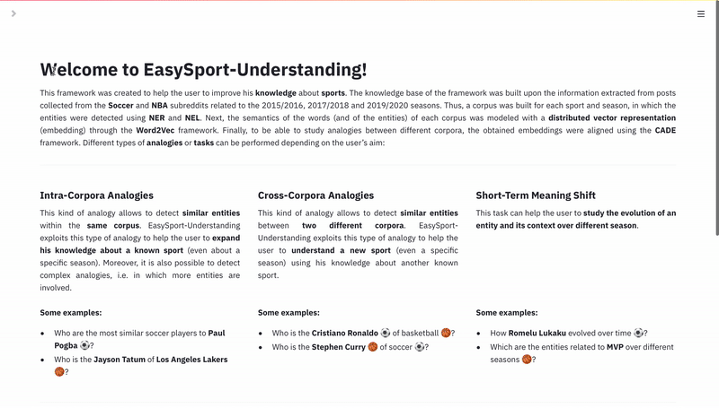

# EasySport-Understanding

The aim of the project was to create an application where people can improve their knowledge about sports exploiting common knowledge retrieved from the web. This knwoledge was based on word embeddings built from Reddit's submissions and word embeddings alignment techniques.

## Requirements
To install the requirements:

    pip install -r requirements.txt

## Data
The dataset was created using the official Pushshift.io API for reddit. It includes submissions about soccer (r/soccer) and basketball (r/nba) coming from three different seasons (2015/2016, 2017-2018 and 2019/2020).

## References
* Di Carlo, Valerio, Federico Bianchi, and Matteo Palmonari. "Training temporal word embeddings with a compass." Proceedings of the AAAI Conference on Artificial Intelligence. Vol. 33. No. 01. 2019.
* Mikolov, Tomas, et al. "Efficient estimation of word representations in vector space." arXiv preprint arXiv:1301.3781 (2013).

## Authors
* Lorenzo Pirola &nbsp;
 &nbsp;
 &nbsp;

* Matteo Romanato &nbsp;
 &nbsp;
 &nbsp;

  
* Youssef Karrati &nbsp;
 &nbsp;
 &nbsp;
  
## Demo

